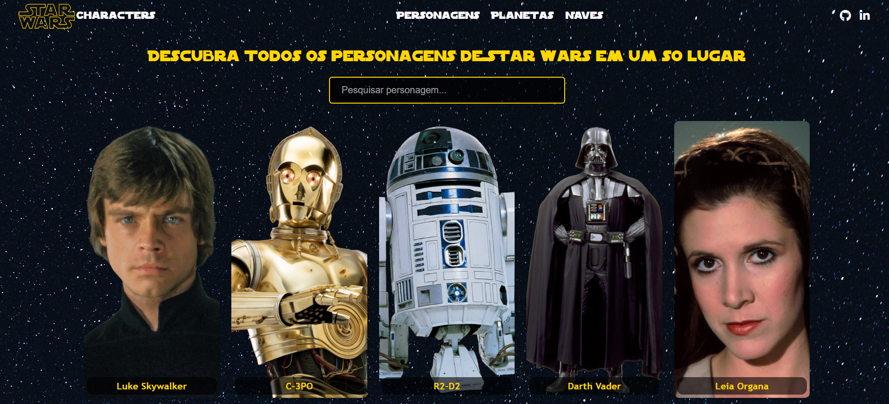
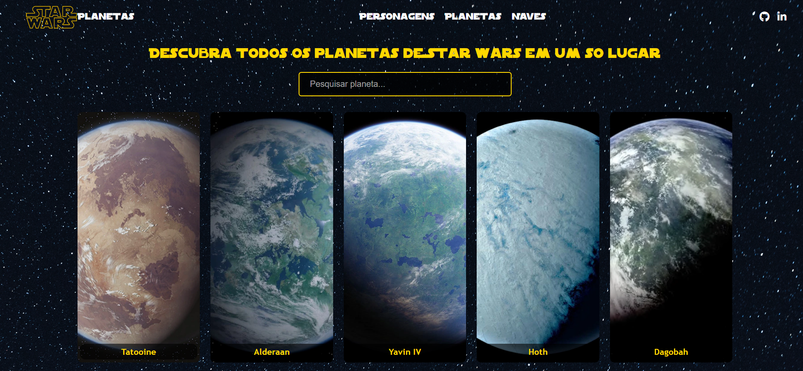
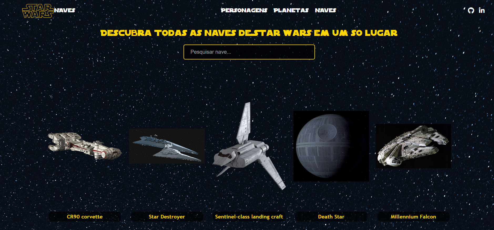
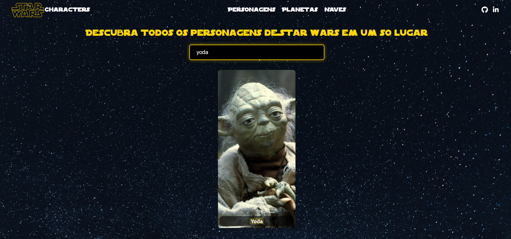

# Star Wars Universe Explorer

Aplicacao web em JavaScript puro para explorar personagens, planetas e naves do universo Star Wars com busca, paginacao, modal de detalhes e fallback de API.

Live Demo: https://tamicoding.github.io/starwars-universe/

## PT-BR

### Visao geral

Este projeto foi desenvolvido com foco em JavaScript puro, manipulacao de DOM e consumo de API sem uso de framework.

O principal diferencial deste projeto foi a sua recuperacao tecnica: em diferentes momentos, a API principal ficou instavel e a fonte externa de imagens deixou de ser confiavel. Em vez de abandonar o projeto, eu implementei fallback entre endpoints compativeis, reorganizei os assets localmente e refatorei a base para manter a aplicacao funcional e mais resiliente.

### Destaques para portfolio

- JavaScript puro com `fetch` e `async/await`
- Busca global para personagens, planetas e naves
- Estrategia de fallback para instabilidade da API
- Assets locais para reduzir dependencia externa
- Refatoracao de codigo repetido em uma camada compartilhada
- Estados de loading, erro e busca sem resultado
- Responsividade e melhorias de acessibilidade no modal

### Galeria







### Principais funcionalidades

- Listagem de personagens, planetas e naves
- Busca em tempo real
- Paginacao
- Modal com detalhes de cada item
- Imagens locais por slug
- Persistencia por sessao com `sessionStorage`

### Desafios enfrentados

#### 1. Instabilidade da API

A API principal nem sempre respondia de forma confiavel. Para evitar que o projeto ficasse indisponivel, foi implementada uma estrategia de fallback entre diferentes endpoints compativeis com a SWAPI.

#### 2. Dependencia de imagens externas

O projeto dependia de uma fonte externa de imagens que deixou de funcionar bem. A solucao foi recuperar os assets manualmente, salvar tudo localmente e adaptar o carregamento para um padrao por nome, deixando o projeto independente da ordem ou do ID da API.

### Decisoes tecnicas

- Centralizacao da logica compartilhada entre personagens, planetas e naves
- Uso de fallback de API para aumentar resiliencia
- Migracao das imagens para assets locais
- Busca desacoplada da ordem numerica dos recursos
- Uso de `sessionStorage` para manter estado apenas durante a sessao

### Tecnologias

- HTML5
- CSS3
- JavaScript puro
- SWAPI
- sessionStorage

### Como executar localmente

```bash
git clone https://github.com/tamicoding/star-wars-characters.git
cd star-wars-characters
```

Abra `docs/index.html` no navegador.

## English

### Overview

This project was built with a focus on vanilla JavaScript, DOM manipulation, and API consumption without frameworks.

Its main strength is not only the interface, but also the technical recovery behind it: at different moments, the main API became unstable and the external image source stopped being reliable. Instead of discarding the project, I implemented API fallback logic, moved assets to local files, and refactored the shared front-end layer to keep the application stable and maintainable.

### Portfolio highlights

- Vanilla JavaScript with `fetch` and `async/await`
- Global search for characters, planets, and starships
- API fallback strategy for unstable endpoints
- Local image assets to reduce external dependency
- Refactoring repeated logic into a shared layer
- Loading, error, and empty-search states
- Responsive layout and modal accessibility improvements

### Gallery


### Main features

- Characters, planets, and starships listing
- Real-time search
- Pagination
- Detail modal for each item
- Local slug-based image assets
- Session-based state persistence with `sessionStorage`

### Challenges solved

#### 1. API instability

The main API was not always reliable. To avoid downtime, I implemented a fallback strategy across compatible SWAPI endpoints.

#### 2. External image dependency

The project originally depended on an external image source that became unreliable. I solved that by recovering the assets manually, storing them locally, and updating the project to resolve images by name instead of relying on API order or raw IDs.

### Technical decisions

- Shared logic layer for characters, planets, and starships
- API fallback strategy for better resilience
- Migration to local assets
- Search decoupled from API ordering
- `sessionStorage` used for session-only persistence

### Tech stack

- HTML5
- CSS3
- Vanilla JavaScript
- SWAPI
- sessionStorage

### How to run locally

```bash
git clone https://github.com/tamicoding/star-wars-characters.git
cd star-wars-characters
```

Open `docs/index.html` in your browser.

## Author

Tamiris Reis

- GitHub: https://github.com/tamicoding
- LinkedIn: https://www.linkedin.com/in/tamirisfreis/
